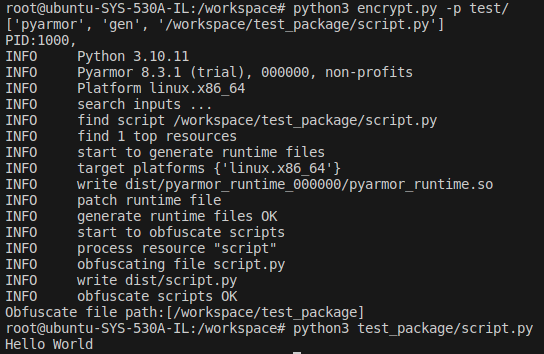

# Obfuscate-pyfile

## Getting Started

## Ubuntu
### Pre-requirements

Install **docker** before installing the docker container.

- [Tutorial-docker](https://docs.docker.com/engine/install/ubuntu/)

### Building image
```shell
sudo chmod u+x ./docker/*.sh
sudo ./docker/build.sh
```

### Run docker container
```shell
sudo chmod u+x ./docker/*.sh
sudo ./docker/run.sh
```

### Obfuscate your pyfile

```python
python3 encrypt.py -p folder
```
- p: The path of encrypt folder.

### Eample
```python
python3 encrypt.py -p test/
```
<details>
    <summary> Result
    </summary>
      <div align="center">
        
      </div>
</details>
